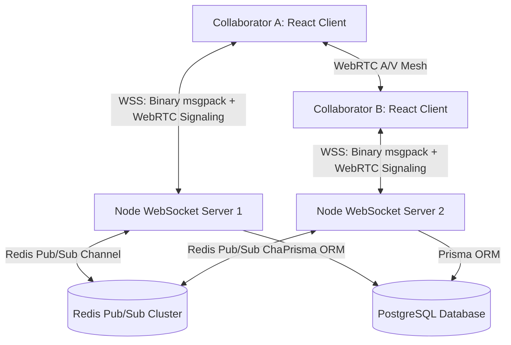

<div align="center">
  
  
  <h1>🎨 CollabCanvas</h1>
  <p><strong>Enterprise-Ready Real-Time Collaborative Workspace</strong></p>

  <p>
    <a href="#features">Features</a> •
    <a href="#architecture">Architecture</a> •
    <a href="#tech-stack">Tech Stack</a> •
    <a href="#quick-start">Quick Start</a>
  </p>
</div>

CollabCanvas is a high-performance, real-time collaborative whiteboarding and coding workspace. It enables multiple developers, designers, and managers to draw sketches, collaboratively edit code inside an integrated Monaco IDE with live cursors, share files, and hold peer-to-peer WebRTC audio and video calls on an infinite zoomable canvas.

---

## ✨ Features

### 🚀 Real-time Synchronization (Yjs CRDTs)
- **Zero-Conflict Editing**: Powered by Yjs Conflict-free Replicated Data Types (CRDTs). Mathematical convergence guarantees all users see the exact same canvas regardless of latency.
- **Binary WebSockets**: Uses highly optimized MessagePack binary payloads (`Uint8Array`) over WebSockets instead of bloated JSON, reducing bandwidth consumption by up to 75%.

### 🎥 Peer-to-Peer Video & Audio Mesh
- **Decentralized WebRTC**: Built-in decentralized video and audio calling using `simple-peer`. 
- **Dynamic Floating UI**: WebRTC Video tracks are mapped into a sleek, floating UI component overlaying the canvas, complete with camera and microphone toggles.
- **STUN/TURN Fallbacks**: Handles strict enterprise firewalls using robust ICE candidate signaling over the existing WebSocket mesh.

### 🖼️ Infinite Collaborative Canvas
- **60 FPS Rendering Engine**: Built on ReactFlow. Elements outside the visible screen boundary are temporarily unmounted (`onlyRenderVisibleElements`) keeping rendering speeds at a solid 60 FPS even with hundreds of nodes.
- **Custom Resizable Nodes**: 
  - **Code Editor**: A full-bleed dark-themed Monaco Editor with live remote cursors indicating collaborator typing locations.
  - **Whiteboard**: Physical dry-erase board aesthetic with high-contrast sketching.
  - **Images**: Drag-and-drop full-bleed media rendering.

### 🏢 Workspace Management
- **Persistent & Session Rooms**: Create lifetime workspaces or secure time-limited sessions (1h, 24h, 7d) that self-clean using PostgreSQL cascading deletes.

---

## 🏗️ Architecture & Data Flow

CollabCanvas is built for horizontal scalability using Node.js and Redis.



### Multi-Server Scaling (Redis Pub/Sub)
When scaled horizontally behind a load balancer, users connected to different WebSocket servers must still collaborate. The backend captures `ydoc:update` and `webrtc:signal` events and publishes them to a shared Redis Channel. Other server instances immediately broadcast this to their local clients, forming a seamless multi-server real-time mesh.

---

## 💻 Tech Stack

- **Frontend:** React 18, Vite, Zustand, Tailwind CSS 4, ReactFlow
- **Editor & CRDTs:** Monaco Editor, Yjs, `y-websocket`, `y-monaco`
- **Backend:** Node.js, Express, `ws` (WebSockets)
- **Database & Scaling:** PostgreSQL, Prisma ORM, Redis
- **Media:** WebRTC (`simple-peer`)

---

## 🚀 Quick Start

Spin up the entire stack—including the React frontend, Express backend, PostgreSQL, and Redis—in one command:

```bash
docker-compose up --build
```

- **Frontend Interface**: [http://localhost:8080](http://localhost:8080)
- **Backend API & WebSockets**: [http://localhost:4000](http://localhost:4000)

### Local Development
If you prefer running the servers natively without Docker:

```bash
# 1. Install Dependencies
npm install

# 2. Run Database Migrations
npm run prisma:generate

# 3. Start Frontend & Backend
npm run dev:client
npm run dev:server
```

---

## 📜 Documentation
For a deep dive into the system design, deployment strategies, and implementation details, please see the [Project Overview Document](./PROJECT_OVERVIEW.md).
